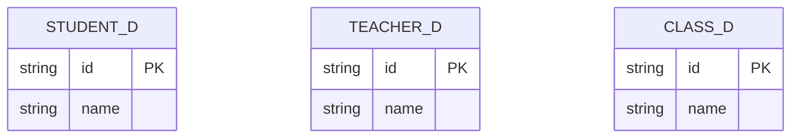

## Type of tables

- Dimension Tables
  Example: STUDENT_D, TEACHER_D, CLASS_D etc.
- Fact Tables (a.k.a. Time-Series / Transactional Tables)
  Example: TBD etc.

### Schema

```mermaid
erDiagram
    STUDENT_D {
        string id PK
        string name
    }
    TEACHER_D {
        string id PK
        string name
    }
    CLASS_D {
        string id PK
        string name
    }
```
